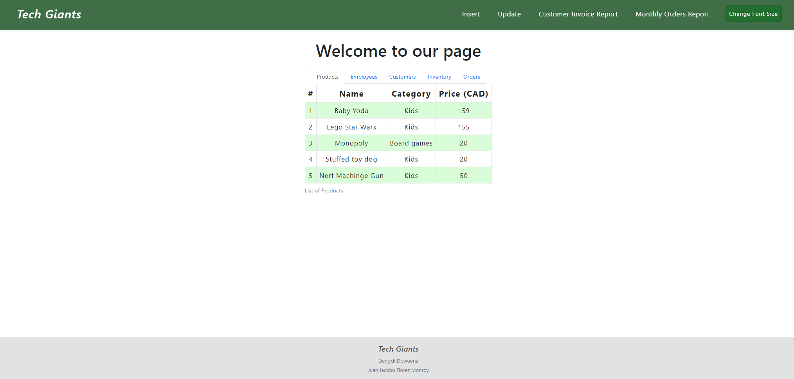
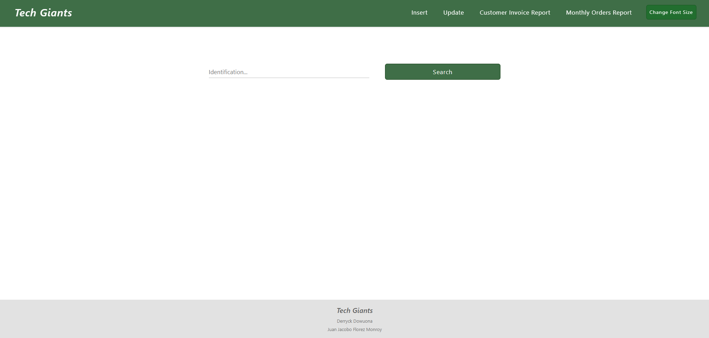
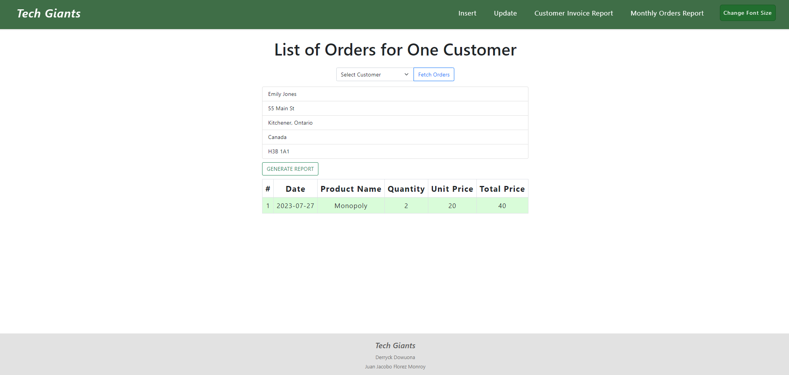
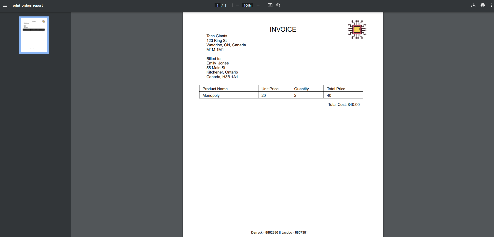
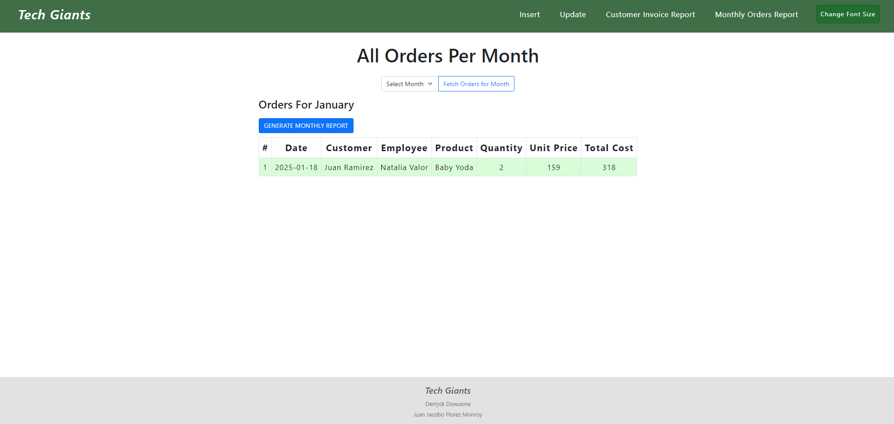
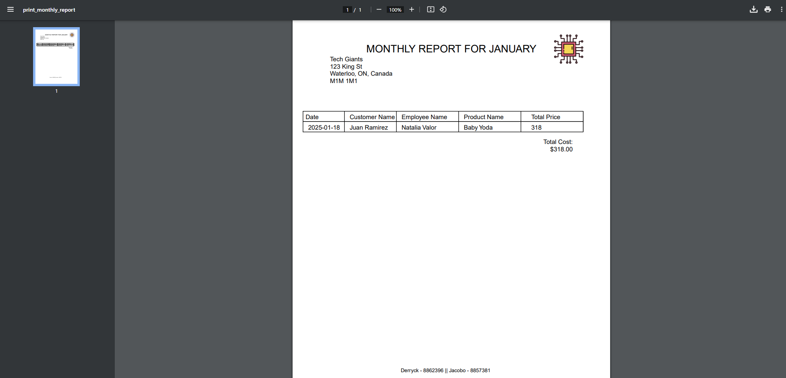

# 🌟 Tech Giants - Comprehensive Management System

## 🎮 Project Description

**Tech Giants** is a management system designed to optimize operations for inventories, employees, products, customers, and orders. This project was developed as a **final group college assignment**, showcasing skills in full-stack web development and teamwork.

The system provides an interactive and responsive interface, enabling efficient visualization, insertion, updating, and reporting of key data.

---

## 🌍 Live Demo

🚀 **Try it out here**: [Tech Giants Live Demo](https://tech-giants-production.up.railway.app)

---

## 🚀 Key Features

- **📋 Inventory Management:** Real-time visualization of product stock.
- **👥 Employee Management:** Registration and supervision of employee data.
- **🛒 Order Management:** Creation, tracking, and price calculation.
- **📈 Report Generation:** Monthly and customer-specific reports in PDF format.
- **📧 Customer Management:** Registration and detailed information updates.

---

## 🔧 Technologies Used

### 💻 Frontend
- 🎨 **EJS** - Dynamic templates for the interface.
- 🖌️ **Bootstrap 5** - Modern styling and responsive design.
- 🎭 **CSS3** - Custom styling.

### ⚙️ Backend
- 🚀 **Node.js with Express.js** - Server logic and route handling.
- 🗂️ **Mongoose** - Data modeling for MongoDB.

### 🗄️ Database
- ☁️ **MongoDB Atlas** - Cloud-based database.

### 🔧 Additional Tools
- 📄 **PDFKit** - PDF report generation.
- 🔐 **dotenv** - Environment variable management.

---

## 📌 Project Purpose

This project demonstrates:

- **Full-Stack Development:** Integration of frontend and backend technologies.
- **Database Management:** Efficient use of MongoDB with Mongoose for data handling.
- **User Role Management:** Secure authentication and user roles for better access control.
- **Dynamic UI Components:** Implementation of EJS for reusable templates and improved user experience.
- **PDF Report Generation:** Automated report creation for business insights.
- **Scalability & Optimization:** Well-structured backend and optimized queries for performance.

---

## 📂 Project Structure

```
📝 TechGiants
├── 📝 controllers/         # Business logic controllers
│   ├── homeController.js
│   ├── insertController.js
│   ├── reportsController.js
│   └── updateController.js
├── 📝 jsons/               # JSON files for database population
│   ├── customer.json
│   ├── employee.json
│   ├── inventory.json
│   ├── order.json
│   └── product.json
├── 📝 models/              # Data models
│   ├── customerModel.js
│   ├── employeeModel.js
│   ├── inventoryModel.js
│   ├── orderModel.js
│   └── productModel.js
├── 📝 views/               # EJS templates
│   ├── home.ejs
│   ├── insert.ejs
│   ├── update.ejs
│   ├── reports.ejs
│   └── monthly_report.ejs
├── 📝 public/              # Static resources (CSS, JS, images)
│   ├── css/
│   │   ├── style.css
│   │   ├── insert_update.css
│   │   └── update.css
│   └── js/
│       ├── changeFontFamilyWebsite.js
├── 📄 .env                 # Environment variables
├── 📝 server.js            # Main server
├── 📝 routes.js            # Route definitions
└── 📝 README.md            # This file
```

---

## 📚 Usage Instructions

### 1️⃣ Environment Setup:
1. Clone this repository:
   ```bash
   git clone <repository_url>
   ```
2. Install dependencies:
   ```bash
   npm install
   ```
3. Configure environment variables in a `.env` file:
   ```env
   MONGO_URI=mongodb+srv://<user>:<password>@<cluster>.mongodb.net/<database>
   ```

### 2️⃣ Populate the Database:

This project includes a `jsons` folder with pre-defined JSON files to populate the database with sample data. To populate the database:
1. Open a MongoDB client or tool like `mongoimport`.
2. Use the JSON files located in the `jsons` folder to insert data into the respective collections (e.g., `customer.json`, `product.json`).
   ```bash
   mongoimport --uri "<MONGO_URI>" --collection <collection_name> --file ./jsons/<file_name>.json --jsonArray
   ```

### 3️⃣ Run the Project:
1. Start the server:
   ```bash
   npm start
   ```
2. Access the system in your browser:
   ```
   http://localhost:4545
   ```

---

## 🌟 Highlighted Features
- **🎨 Responsive Design:** Compatible with both mobile and desktop devices.
- **📈 PDF Reports:** Export key data for external analysis.
- **⚡ Optimization:** Optimized routes and queries for efficient performance.

## 🖼 Screenshots

| Home | Insert | Update |
|-----------|-----------|-----------|
|  |  |  |

| Customer Invoice Report | PDF |
|-----------|-----------|
|  |  |

| Monthly Orders Report | PDF |
|-----------|-----------|
|  |  |

---

## 💼 Author

👤 **Juan Jacobo Florez Monroy**  
🌐 **Portfolio**: [jjacobo95.com](https://jjacobo95.com)  
🐙 **GitHub**: [github.com/jjacoboflorez95](https://github.com/jjacoboflorez95)